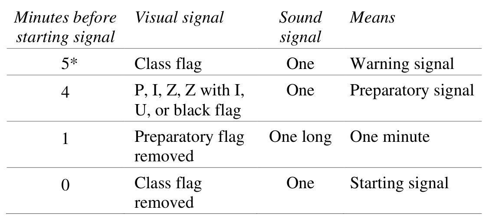

- **Rule 10: ON OPPOSITE TACKS** #card
	- When boats are on opposite tacks, a port-tack boat shall keep clear
	  of a starboard-tack boat.
- **Rule 11: ON THE SAME TACK, OVERLAPPED** #card
	- When boats are on the same tack and overlapped, a windward boat
	  shall keep clear of a leeward boat.
- **Rule 12: ON THE SAME TACK, NOT OVERLAPPED** #card
	- When boats are on the same tack and not overlapped, a boat clear
	  astern shall keep clear of a boat clear ahead.
- **Rule 13: WHILE TACKING** #card
	- After a boat passes head to wind, she shall keep clear of other boats until she is on a close-hauled course. During that time rules 10, 11 and 12 do not apply. If two boats are subject to this rule at the same time, the one on the other’s port side or the one astern shall keep clear.
- **Rule 14: AVOIDING CONTACT** #card
	- If reasonably possible, a boat shall
		- (a) avoid contact with another boat,
		- (b) not cause contact between boats, and
		- (c) not cause contact between a boat and an object that should be avoided.
	- However, a right-of-way boat, or one sailing within the room or mark-room to which she is entitled, need not act to avoid contact until it is clear that the other boat is not keeping clear or giving room or mark-room.
	- **Exception 43.1 (c)**
		- A right-of-way boat, or one sailing within the room or mark-room to which she is entitled, is exonerated for breaking rule 14 if the contact does not cause damage or injury.
- **Rule 15: ACQUIRING RIGHT OF WAY** #card
	- When a boat acquires right of way, she shall initially give the other boat room to keep clear, unless she acquires right of way because of the other boat’s actions.
- **Rule 16: CHANGING COURSE** #card
	- **16.1** When a right-of-way boat changes course, she shall give the other boat room to keep clear.
	- **16.2** In addition, on a beat to windward when a port-tack boat is keeping clear by sailing to pass to leeward of a starboard-tack boat, the starboard-tack boat shall not bear away if as a result the port-tack boat must change course immediately to continue keeping clear.
- **Rule 17: On the same tack; Proper Course** #card
	- *"If a boat clear astern becomes overlapped within two of her hull lengths to leeward of a boat on the same tack, she shall not sail above her proper course while they remain on the same tack and overlapped within that distance, unless in doing so she promptly sails astern of the other boat."*
- **Section C - At Marks and Obstructions**
- **Rule 18: MARK-ROOM**
	- **18.1 When Rule 18 Applies**
		- (a) Rule 18 applies between boats when they are required to leave a mark on the same side and at least one of them is in the zone. However, it does not apply
			- (1) between boats on opposite tacks on a beat to windward,
			- (2) between boats on opposite tacks when the proper course at the mark for one but not both of them is to tack,
			- (3) between a boat approaching a mark and one leaving it, or
			- (4) if the mark is a continuing obstruction, in which case rule 19 applies.
		- (b) Rule 18 no longer applies between boats when mark-room has been given.
	- **18.2 Giving Mark-Room**
		- (a) When the first of two boats reaches the zone,
			- (1) if the boats are overlapped, the outside boat at that moment shall give the inside boat mark-room;
			- (2) if the boats are not overlapped, the boat that has not reached the zone at that moment shall give the other boat mark-room. When a boat is required to give mark-room by this rule, she shall continue to do so for as long as this rule applies, even if later an overlap is broken or a new overlap begins.
		- (b) Rule 18.2(a) no longer applies if the boat entitled to mark-room passes head to wind or leaves the zone.
		- (c) When rule 18.2(a) does not apply and the boats are overlapped, the outside boat shall give the inside boat mark-room.
		- (d) If a boat obtained an inside overlap from clear astern or by tacking to windward of the other boat and, from the time the overlap began, the outside boat has been unable to give mark-room, rules 18.2(a) and 18.2(c) do not apply between them.
		- (e) If there is reasonable doubt that a boat obtained or broke an
		  overlap in time, it shall be presumed that she did not.
	- **18.3 Tacking in the Zone**
		- If a boat passes head to wind from port to starboard tack in the zone of a mark to be left to port, rule 18.2 does not apply between her and another boat on starboard tack that is fetching the mark. If the other boat has been on starboard tack since entering the zone, the boat that passed head to wind
			- (a) shall not cause the other boat to sail above close-hauled to avoid contact, and
			- (b) shall give mark-room if the other boat becomes overlapped inside her.
	- **18.4 Gybing in the Zone**
		- When an inside overlapped right-of-way boat must gybe at a mark to sail her proper course, until she gybes she shall sail no farther from the mark than needed to sail that course. Rule 18.4 does not apply at a gate mark.
- **Rule 19: ROOM TO PASS AN OBSTRUCTION**
- **Rule 20: ROOM TO TACK AT AN OBSTRUCTION**
- **Rule 26: STARTING RACES**
	- *Races shall be started by using the following signals. Times shall be taken from the visual signals; the absence of a sound signal shall be disregarded.*
- {:height 353, :width 780}
	- **or as stated in the notice of race or sailing instructions*
	- *The warning signal for each succeeding class shall be made with or after the starting signal of the preceding class.*
- **Section D - Other Rules**
	- Negates section A rules
- **Rule 21: STARTING ERRORS; TAKING PENALTIES; BACKING A SAIL**
- **Rule 22: CAPSIZED, ANCHORED OR AGROUND; RESCUING**
- **Rule 23: INTERFERING WITH ANOTHER BOAT**
- **Rule 31: TOUCHING A MARK**
	- *While racing, a boat shall not touch a starting mark before starting, a mark that begins, bounds or ends the leg of the course on which she is sailing, or a finishing mark after finishing.*
- **Rule 43: EXONERATION**
-
-
-
-
-
- Reach marks and Mark Room
	- if a boat passes head to wind from port to starboard tack in the zone of a mark to be left to port, rule 18.2 does not apply between her and another boat on starboard tack that is fetching the mark. If the other boat has been on starboard tack since entering the zone, the boat that passed head to wind:
		- (a) shall not cause the other boat to sail above close-hauled to avoid contact, and
		- (b) shall give mark-room if the other boat becomes overlapped inside her.
- Proper Course
- Tacking at the top mark
	- room to tack at obstruction
		- A boat may hail for room to tack and avoid a boat on the same tack by hailing "room to tack"